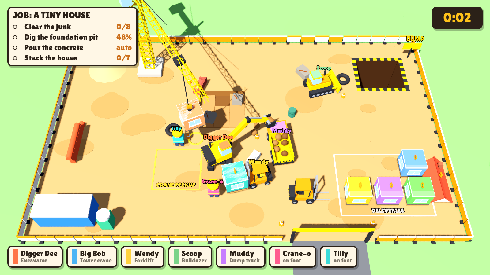

# The Builders

Couch co-op construction chaos for 1 to 8 players. Everyone shares one
building site, seen from above. Walk to a machine, hop in, and get the job
done together: clear the junk, dig the foundation pit, haul the dirt away,
let the concrete pour, then forklift the house modules to the crane and
stack a tiny house.

The machines are toys, but they don't all drive like toys. The bulldozer has
one stick per track, the forklift steers with its rear wheels, the excavator
uses real two-stick digger controls and the crane's load swings on its rope.
That is the point.



## The job: a tiny house

| Step | Who | How |
| --- | --- | --- |
| Clear the junk | Bulldozer | Push the sofa, tyres, slabs and the old fridge into the **DUMP** hole |
| Dig the foundation pit | Excavator | Scoop the nine dirt cells down to the pit floor |
| Haul the dirt | Excavator + dump truck | Dump into the truck, drive it to the hole, tip the bed. Dirt spilled back into the pit fills it again |
| Pour the concrete | Automatic | Starts the moment the pit is fully dug |
| Stack the house | Forklifts + crane | Forklift modules from **DELIVERIES** to **CRANE PICKUP**, crane them onto the glowing slots: four below, two on top, then the roof |

A module that falls in the dump is reordered and delivered again. The timer
gives three stars under 8 minutes and two under 12.

## Controls

On foot: left stick walks, **A** climbs into the nearest free machine, **B**
climbs out. Fast machines knock builders over. The player strip shows each
machine's controls for a few seconds after you climb in.

| Machine | Controls |
| --- | --- |
| Bulldozer | Left stick: left track, right stick: right track |
| Excavator | Left stick: swing / arm in-out, right stick: boom / bucket curl, triggers and bumpers: tracks. Dirt stays in while the bucket faces up |
| Forklift | Left stick: steer (rear wheels), RT / LT: drive / reverse, right stick: forks |
| Dump truck | Left stick: steer, RT / LT: drive / reverse, Y or RB: tip the bed |
| Tower crane | Left stick: rotate / trolley, right stick: hoist, A: hook on / let go, LB / RB: turn the load |

The GameNight setting **Machine controls: easy** gives the bulldozer and
forklift normal steering and damps the crane's swing.

Without GameNight, press A on a pad, Space (WASD + IJKL keyboard player) or
Enter (arrows + numpad player) to join. Esc pauses.

## Run

```sh
godot --path .                     # empty site, players drop in
godot --path . -- --demo           # five machines with scripted drivers
godot --path . -- --demo --pose    # frozen mid-job moment for screenshots
tools/shot.sh out.png --demo --pose --shot-time=2.5   # headless screenshot (xvfb)
```

`--stage=dug|half|built` jumps the job forward, `--cam=x,z,distance,tilt`
moves the camera.

## Tests

```sh
godot --headless --path . --script tests/job_check.gd   # every machine does its job step
python3 tests/lifecycle.py --godot godot                # managed launch against a fake GameNight host
```

`job_check.gd` drives each machine with scripted sticks on a real site:
scooping and spilling dirt, lifting and reversing with a pallet, craning a
module onto its slot (and the load swinging when slewing), bulldozing junk
into the dump and tipping the truck bed.

## GameNight

Uses the [GameNight Godot addon](https://github.com/ontola/gamenight/tree/main/sdk/godot)
in `addons/gamenight`. CI fails when the copy drifts from the SDK; update it
with `python sdk/godot/sync.py path/to/the-builders` from a gamenight checkout.
Under GameNight, seats become builders, the host owns pause, and a finished
house reports the round and starts the next job.

## Code

- `src/main.gd`: players, camera, GameNight lifecycle, demo and screenshots
- `src/site.gd`: the level and the job: ground, pit cells, dump, slots, deliveries
- `src/machine.gd`: shared rigid-body machine with arcade drive helpers
- `src/bulldozer.gd`, `excavator.gd`, `forklift.gd`, `dump_truck.gd`, `crane.gd`: the machines
- `src/module.gd`: house modules and the roof on pallets
- `src/worker.gd`: builders on foot
- `src/hud.gd`, `src/toy.gd`: interface and the primitive toy look
